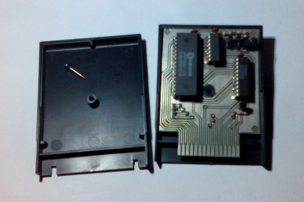
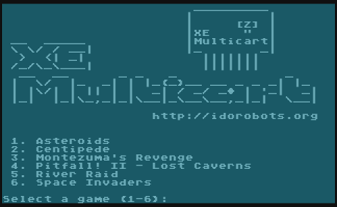

# XE Multicart

A multi-game cartridge for the Atari 400/800/XL/XE with software game selection which can hold up to 127 games!

 

# How it works?

A `74HCT373` latch is used for extra address pins, it's accessed by writing to the cartridge control block (`$DF00`) causing a bank switch. After selecting appropriate ROM bank, the firmare resets the console in turn starting the game. To select another game, reboot your Atari.

# Assembly instructions
## PCB
Assuming that you already have the PCBs on hand, either by ordering them on-line or creating them yourself, the assembly is pretty simple - just solder the `74HTC373` latch, the transistor and the passive components. It is highly recommended to solder a socket for the memory chip as it makes it much easier to re-program it. **Also, keep in mind that the component side goes into the console facing down, so prepare your case accordingly.**

## Memory chip configuration

The PCB layout of this cartridge is customizable - you can fit any 28/32-pin JEDEC-compliant EPROM chip in the `27C` line or compatible flash memory chip with size ranging from as low as 64 kbit up to 8 mbit. Fitting larger chips means you will be able to store more game ROMs (up to 127 total), but you can also use this layout without the game selection firmware to store any single standard 8k/16k game you want.

### Jumper settings

There are four jumpers on the PCB - `JP1` to `JP4` - oriented vertically when looking at the top layer with the edge connector facing down:

```
      0   0   0   0\ UP
DOWN /0   0   0   0/
     \0   0   0   0
     JP1 JP2 JP3 JP4
```

These are used to configure the cartridge for the appropriate memory chip. The following table lists jumper settings for various common configurations (UP means "short top two pins", DOWN means "short bottom two pins" and X means "don't care"):

| Memory chip size | JP1  | JP2  | JP3  | JP4  |
| ---------------- | ---- | ---- | ---- | ---- |
| 64k (27C64)      | X    | X    | UP   | UP   |
| 128k (27C128)    | X    | X    | UP   | UP   |
| 256k (27C256)    | X    | X    | UP   | DOWN |
| 512k (27C512)    | X    | X    | UP   | DOWN |
| 1m (27C010)       | UP   | UP   | X    | DOWN |
| 2m (27C020)       | UP   | UP   | DOWN | DOWN |
| 4m (27C040)       | UP   | DOWN | DOWN | DOWN |
| 8m (27C080)       | DOWN | DOWN | DOWN | DOWN |

## Building the firmware
In order to build the firmware & a cartridge image you will need some standard 8k/16k ROM files (obtainable freely on the Internet). Another prerequisite is having Python3 installed and available. Put your ROMs into the `roms/` directory and type:

```
make
```

This will run a script that automatically detects and arranges the games, builds the firmware and compiles a cartridge image ready for burning with your favourite EPROM burner.

Alternatively, you can supply a custom ROMs directory like this:

```
make ROMS=path/to/roms/directory
```

If you encounter any troubles while building, make sure to rebuild everything cleanly:

```
make clean && make
```

# Running in an emulator

Multicart images don't work in any emulators that I know of, because they are using a custom (if simplistic) bank-switching mechanism. For testing purposes, you can run just the `menu.bin` (the game selection firmware) by loading it as a standard 8k cartridge ROM in your favourite Atari 800/XE emulator. For example:

```
atari800 -xl -xlxe_rom path/to/ATARIXL.ROM -cart menu.bin
```

It'll display the game selection menu, but any attempts at selecting a game will result in restarting the game selection menu.

# License

Software & hardware licensed under the MIT license (see LICENSE file for details). The OSHW logo comes from the [BFL library](http://www.baconfatlabs.com/2011/11/oshw-eagle-symbols-for-schematic-and-silkscreen/), licensed under CC-BY-SA. Any commercial product names seen on software screenshots are for demonstration purposes only and are not included with this product.
